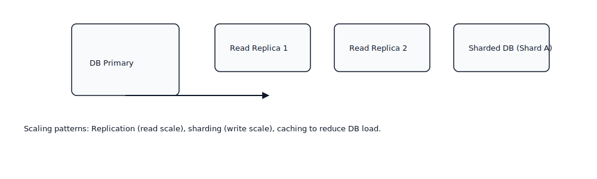

# System Design: Latency and Throughput

This repository provides a comprehensive engineering guide to **Latency** and **Throughput** in distributed system design. It contains detailed explanations, industry best practices, worked examples, measurement guidance, and visual diagrams that illustrate common architecture and optimization patterns.

> Location of diagrams: `./diagrams/` — both SVG and PNG preview versions are included.

---

## Repository Contents
- `Latency-Throughput.md` — this document (detailed explanations and examples)
- `README.md` — repository overview and quickstart
- `diagrams/` — SVG diagrams and `png/` previews
- `push_to_github.sh` — helper script to push to your GitHub repository
- `LICENSE` — MIT license

---

## High-Level Architecture (diagram and explanation)


**What this diagram shows**

A typical web application request traverses multiple layers: the client, CDN/edge, load balancer, API gateway, stateless application services, caches, databases, and background processing systems. Each hop adds latency (network RTT, processing time, serialization) and contributes to the system's maximum throughput capacity (how many requests can be handled concurrently).

**Example impact:** If Redis is unavailable, many requests will fall back to the database, increasing average latency from single-digit milliseconds to tens or hundreds of milliseconds, and significantly reducing overall throughput due to DB saturation.

---

## Core Concepts

### Latency
Latency is the total time to complete a single operation or request end-to-end. It includes network round-trips, protocol overhead (TLS handshakes), queuing delays, service processing, and I/O waits.

**Percentiles matter.** Use P50 to measure the typical user experience and P95/P99 to capture the "tail" behavior that impacts real users during spikes.

**Worked example**  
A user profile request might include:
- DNS lookup (30 ms)
- TCP handshake and TLS setup (50 ms)
- Request serialization and server processing (15 ms)
- Cache lookup (3 ms)
- JSON serialization and response (2 ms)
- Network return trip (50 ms)

**Total:** 150 ms. If the P95 baseline is 150 ms and P99 is 1000 ms, investigate tail causes such as GC pauses or slow DB queries.

---

### Throughput
Throughput is the number of requests processed per second (RPS). It depends on concurrency, resource limits (CPU, memory, DB connections), and architecture choices (synchronous vs asynchronous).

**Worked example**  
If a service has 8 CPU cores, 200 ms average processing time per request, and efficient I/O, theoretical max throughput per instance ≈ (8 cores * 1000 ms) / 200 ms = 40 RPS per instance. Real-world throughput will be lower due to context switching, GC, network, and locks.

---

## Latency–Throughput Relationship


As load increases, latency typically remains flat until resources begin to saturate. Past the saturation "knee," latency increases sharply. Use this curve to identify safe operating points for autoscaling and to define SLOs.

**Practical tip:** Aim to operate well left of the knee during normal traffic. Reserve capacity for spikes or use aggressive autoscaling and burstable infrastructure.

---

## Request Lifecycle (Sequence Diagram)


**Step-by-step flow**
1. Client issues request.
2. Load balancer routes to a healthy instance.
3. API Gateway enforces auth, rate-limits, and routes to service.
4. Service checks cache (fast path).
5. On cache miss, service queries database (slow path).
6. Data is returned and possibly written back to cache.
7. Response serialized and returned to client.

Each step is a measurable segment of the total latency and should be instrumented with tracing.

---

## Deployment & Scaling Patterns


**Key patterns**
- **Horizontal scaling** of stateless services behind load balancers for throughput gains.
- **Autoscaling** based on CPU, request latency, or queue length metrics.
- **Worker pools** for background processing to decouple slow work from request path.
- **Database replication and sharding** for read and write scalability, respectively.

---

## Caching: Design and Impact


**How caching reduces latency**  
- Read-heavy paths should check cache first. A cache hit returns in 1–5 ms, while a DB read may cost 20–200+ ms.
- Use TTLs and write-through or write-behind patterns based on consistency needs.
- Monitor cache hit ratio; low hit ratios indicate ineffective keys or small cache sizes.

---

## Asynchronous Processing: Use Cases and Benefits


**When to use queues**
- Non-blocking background tasks: notifications, video processing, heavy analytics.
- Buffer bursts: queues smooth sudden traffic spikes and allow workers to process at sustainable rates.
- Increase end-user throughput by removing heavy tasks from the request path.

---

## Database Scaling Strategies



**Options**
- **Read replicas** for scaling reads.
- **Sharding** for scaling writes and distributing hot keys.
- **Connection pooling** to avoid exhausting DB connections.
- **Denormalization and caching** for read-critical paths.

---

## Measurement and Benchmarking

**Tools**
- `wrk` / `wrk2`: high-performance load generation for HTTP endpoints.  
- `k6` or `Locust` for scriptable scenarios.  
- `Prometheus` + `Grafana` for metrics and dashboards.  
- `OpenTelemetry` + `Jaeger` for distributed tracing.

**Example test command**
```bash
wrk -t8 -c400 -d60s https://api.example.com/profile
```

**What to record**
- RPS (requests per second)
- Error rates and HTTP status distribution
- Latency percentiles (P50, P95, P99)
- CPU, memory, GC pauses, thread counts
- Database slow queries and connection pool usage
- Queue length and consumer lag

---

## Optimization Strategies (Practical Guidance)

### Network and Protocols
- Use keep-alive, HTTP/2 or HTTP/3 where appropriate.
- Minimize TLS handshake overhead via session resumption and shorter cert chains.
- Use CDNs for static content and geo-distribution.

### Application-Level Improvements
- Favor non-blocking I/O and asynchronous libraries.
- Reduce serialization overhead; consider compact binary protocols for internal services.
- Profile and optimize hot code paths; reduce allocations to limit GC.

### Caching Strategy
- Cache at the CDN, API edge, application memory, and dedicated cache store as necessary.
- Tune TTLs based on data freshness requirements.
- Implement cache warming and prefetching for predictable traffic.

### Database and Storage
- Avoid N+1 queries; batch operations where possible.
- Add appropriate indexes for hot queries.
- Use read replicas and scale writes horizontally via sharding.

### Asynchronous & Batch Patterns
- Offload heavy or non-critical work to background workers.
- Use batching for writes to reduce per-request overhead.

### Resilience & Flow Control
- Implement circuit breakers around dependent services.
- Use rate limiting and admission control to prevent overload.
- Use bulkheads and resource isolation to limit blast radius.

---

## Runbook and Troubleshooting Checklist

1. **Define SLOs** (e.g., P95 < 200ms, error rate < 0.1%)  
2. **Collect baseline metrics** in a controlled environment.  
3. **Run incremental load tests** and observe the latency-throughput curve.  
4. **Trace slow requests** to identify component-level bottlenecks.  
5. **Apply targeted fixes** (indexing, caching, batching).  
6. **Repeat tests** and validate improvements.  
7. **Deploy autoscaling rules** with conservative thresholds.  
8. **Monitor production** for at least one business cycle before promoting changes widely.

---


## Appendix: Example Benchmark and Interpretation

**Scenario:** User profile API  
- Baseline (1 instance, no cache): P95 = 450 ms, RPS = 60  
- With Redis cache (80% hit): P95 = 60 ms, RPS = 400  
- Add 4 instances + read replicas: P95 = 55 ms, RPS = 1600

Interpretation: Caching provided the largest single improvement. Horizontal scaling increased throughput with marginal latency improvements once the DB bottleneck was relieved.

---