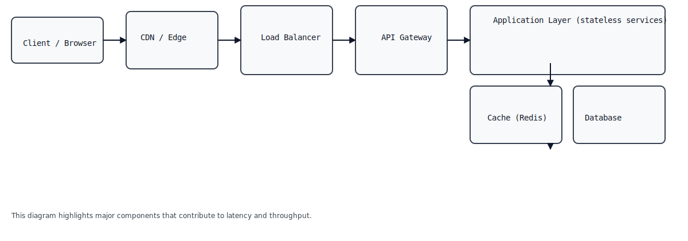

# System Design: Latency and Throughput

This repository explains **Latency** and **Throughput** in system design end-to-end, includes diagrams, measurement/playbook, optimization techniques, benchmarks and actionable steps to push to GitHub.

## Contents
- `SYSTEM_DESIGN.md` — this file (detailed explanation and guidance)
- `README.md` — quick start and repo overview
- `diagrams/` — SVG diagrams referenced in the doc
- `push_to_github.sh` — helper script to push to your GitHub repo (configure `GIT_REMOTE`)

---

## Key Topics Covered
1. Definitions: latency, throughput, and related terms
2. Why they matter (trade-offs, SLOs)
3. Typical system components that affect latency & throughput
4. Measurement and benchmarking (tools and metrics)
5. Optimization strategies (network, caching, DB, async, batching, compression)
6. Diagrams (architecture, sequences, LT curve, deployment patterns)
7. Example checklist and runbook
8. How to push this project to GitHub (commands included)

---

## Diagrams (files in `diagrams/`)
- `high-level-architecture.svg`
- `sequence-request-flow.svg`
- `latency-throughput-curve.svg`
- `deployment-scaling.svg`
- `cache-flow.svg`
- `async-queue-flow.svg`
- `db-scaling.svg`

Embed them in your docs with:
```markdown

```

---

## 1. Definitions

**Latency** — the time it takes to process a single request end-to-end. Measured in milliseconds (ms).  
**Throughput** — the number of requests processed per unit time (requests/sec, rps).

Related terms:
- **P50, P95, P99 latency** — percentile measurements.
- **SLA / SLO** — service-level agreement/objective (e.g., P95 < 200ms).
- **Concurrency** — number of requests handled in parallel.
- **Latency budget** — how latency is allocated across components.

---

## 2. Why they matter

- User experience: High latency → poor UX.
- Capacity planning: Throughput determines required resources.
- Trade-off: Optimizing for throughput may increase latency (batching), and vice versa.

---

## 3. System components that affect latency & throughput

- Client and network (RTT, TLS handshake)
- Load balancer
- API gateway / edge proxies
- CDN / cache
- Application servers (CPU, memory, GC pauses)
- Databases (query time, locks, I/O)
- Message queues (latency added by buffering; increases throughput)
- External third-party services (payment gateways, auth)
- Observability and instrumentation overhead

---

## 4. Measurement & Benchmarking

Tools:
- `wrk` / `wrk2`, `hey`, `ab` for HTTP load testing
- `iperf` for network
- `wrk` example: `wrk -t12 -c400 -d30s http://localhost:8080/endpoint`
- Application metrics: Prometheus + Grafana (expose latency histograms)
- Use distributed tracing (OpenTelemetry, Jaeger) to measure component-wise latency

Metrics to collect:
- Request rate (rps)
- Error rate
- Latency percentiles (P50, P90, P95, P99)
- Server CPU, memory, GC pause times
- Queue lengths and consumer lag
- DB query times, slow query log

Benchmarking approach:
1. Start with baseline (no cache, single instance).
2. Add load gradually (ramp up).
3. Measure latency percentiles and saturation point (where latency jumps).
4. Diagnose hot spots via traces.
5. Iterate.

---

## 5. Optimization strategies (practical)

### Network & Edge
- Use keep-alive, HTTP/2, TLS session resumption.
- Use CDN for static assets.

### Caching
- Edge caching + application-side cache (Redis, Memcached).
- Cache short-lived data selectively; use cache invalidation strategies.

### Application
- Use connection pools.
- Reduce synchronous blocking (use async I/O).
- Use batching where possible.
- Use efficient serialization (binary protocols for internal comms).

### Database
- Read replicas for scale-out reads.
- Sharding for high write throughput.
- Indexing and query optimization.
- Denormalization for read-heavy workloads.

### Asynchronous processing
- Move non-critical work off the request path (queues, background workers).
- Use message queues (Kafka, RabbitMQ) with partitioning for scale.

### Horizontal scaling
- Add more instances behind load balancer; ensure statelessness.

### Backpressure & Flow Control
- Implement rate limiting and circuit breakers.
- Use bulkheads to isolate failures.

### Observability
- Instrument histograms and traces.
- Alert on P95/P99 and queue lag.

---

## 6. Runbook / Checklist

1. Identify SLO targets (e.g., 95% requests < 200ms).
2. Measure baseline.
3. Add caching, measure improvement.
4. Add replicas, measure throughput.
5. Monitor resource saturation (CPU, DB connections).
6. Implement circuit breakers for third-party calls.
7. Repeat load tests.

---

